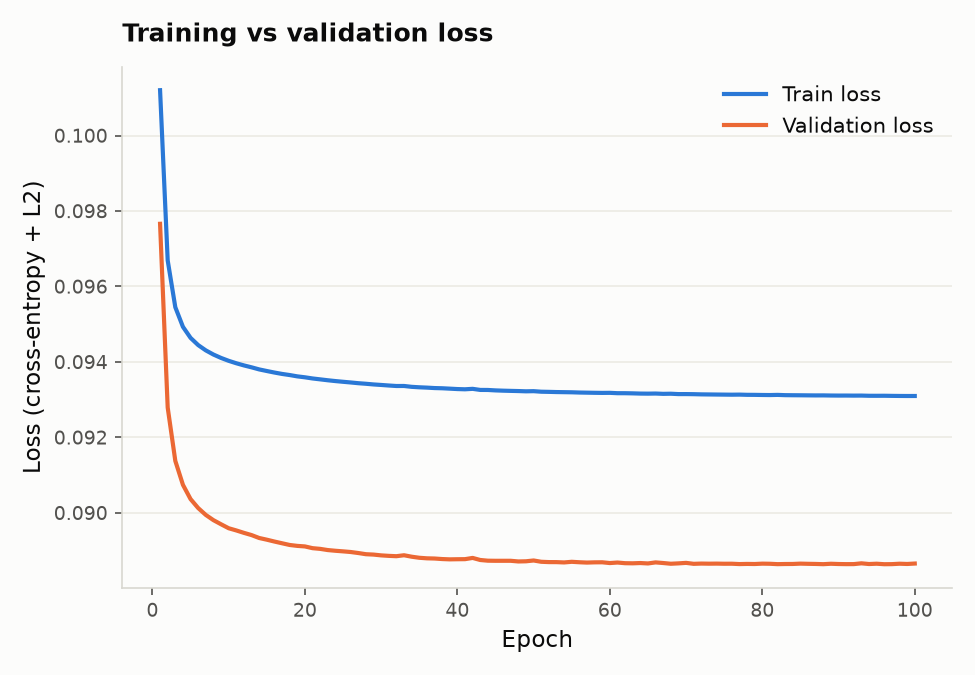
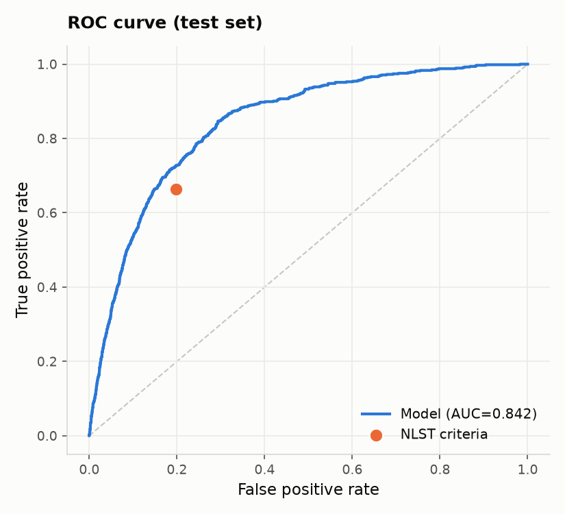
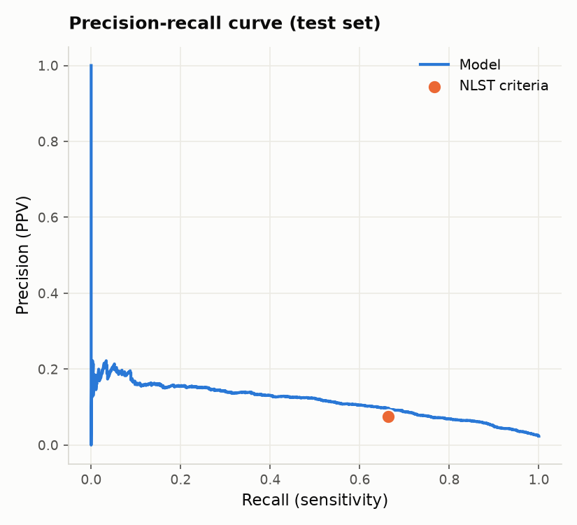

# CPH 100A — Problem Set 1 Report

## 2.1 Ablation study

### Model implementation

The final model is a logistic regression classifier, $p = \sigma(\theta^\top x + b)$, trained with
mini-batch stochastic gradient descent on the binary cross-entropy loss with L2 regularization:

$$L(y, p) = -[y \log(p) + (1-y)\log(1-p)] + \frac{\lambda}{2}\|\theta\|^2$$

**Features (9 total, beyond the age-only baseline):**

| Type | Features | Encoding |
|---|---|---|
| Numerical | `age`, `pack_years`, `cig_years`, `bmi_curr` | standardized to zero mean, unit variance |
| Categorical | `sex`, `race7`, `cig_stat`, `emphys_f`, `lung_fh` | one-hot encoded |

The vectorizer also supports ordinal features (plain integer encoding, no standardization), which would
be the natural way to add a feature like `educat` (education level). We implemented that support but
left it out of the final feature set reported here, since adding it would change every downstream number
in this report and we chose to keep the model fixed once the rest of the analysis was written.

Rows with a missing or unparsable value for any configured feature are dropped from the split they
belong to (train/val/test are filtered independently, using the same rule). This is a simplification
relative to the mean-imputation / missingness-indicator strategies suggested in the assignment — see
the limitations discussion in 2.5.

**Hyperparameters** (selected via the grid search dispatcher, on validation AUC):

| Hyperparameter | Value |
|---|---|
| Learning rate | 0.01 |
| Batch size | 64 |
| Regularization ($\lambda$) | 0 |
| Epochs | 100 (converges by ~epoch 50) |

**Final performance:** train AUC = 0.837, validation AUC = 0.854, test AUC = 0.843.

### Training and validation loss curves

Both curves drop sharply over the first ~10 epochs and plateau by epoch 40-50, indicating the model
has converged rather than being cut off early. Validation loss sits consistently below training loss
throughout — with a single global train/val split (not k-fold), this is most likely a difference in
class prevalence or case mix between the two splits rather than a sign of underfitting, since the
model is simple (linear) and both curves plateau together without divergence (no overfitting).

### Key design decisions

Three things explain most of the distance between the age-only baseline (about 0.60 AUC) and the
final model (about 0.85 AUC).

The single biggest lever was fixing the training loop itself. The first working version of `fit()`
looped over `range(0, num_epochs, batch_size)`, which under the default settings took only one or two
gradient steps in total no matter how large `num_epochs` was, and each of those steps still averaged
the gradient over the full training set instead of a mini-batch. Rewriting the loop to shuffle the
data every epoch and take one gradient step per mini-batch, which is what the model was meant to do
in the first place, took the full-feature model from about 0.74 AUC (a couple of full-batch steps,
barely different from the initial weights) to properly converging over dozens of epochs.

Feature engineering came next. Age alone reaches about 0.60 AUC, adding `pack_years`, `sex` and
`race7` gets to about 0.83, and the full nine-feature set, which also brings in `cig_years`,
`bmi_curr`, `cig_stat`, `emphys_f` and `lung_fh`, reaches about 0.85. Most of that gain traces back to
the smoking-related features, which fits lung cancer epidemiology: smoking history is the dominant
modifiable risk factor, so once it is represented well the remaining features add comparatively little.

Hyperparameter tuning mattered more by ruling things out than by finding a dramatic win. The grid
search consistently favored no L2 regularization: validation AUC decreases smoothly as $\lambda$ grows
from 0 to 0.5, and this holds up across five random seeds with almost no variance (standard deviation
under 0.0005 at every $\lambda$). With only 13 parameters and about 95,000 training rows, the model has
little room to overfit, so regularization here only adds bias with no variance to trade it against,
which matches the L2 vs training loss sweep from part 1.2 showing training loss rising steadily with
$\lambda$.

## 2.2 Analyzing overall model performance

On the test set the model reaches an AUC of 0.842. The ROC curve below sits clearly above the NLST
operating point across most of the range. At the same false positive rate as NLST criteria (about 0.20),
the model reaches a true positive rate of roughly 0.73, compared to 0.66 for NLST. The precision recall
curve looks less dramatic because lung cancer is rare in this cohort (about 2.4% of test patients), so
precision stays low for every method, but the NLST point still lands right on the model's own curve at
matched recall rather than above it.

Breaking the test set AUC down by subgroup gives the following (groups with fewer than 30 patients or
with only one outcome class are dropped, since AUC isn't meaningful there):

| Subgroup | Group | n | AUC |
|---|---|---|---|
| Sex | 1 | 13,742 | 0.821 |
| Sex | 2 | 14,085 | 0.861 |
| Race (race7) | 1 | 24,707 | 0.844 |
| Race (race7) | 2 | 1,344 | 0.865 |
| Race (race7) | 3 | 488 | 0.826 |
| Race (race7) | 4 | 1,031 | 0.814 |
| Race (race7) | 5 | 168 | 0.804 |
| Race (race7) | 6 | 78 | 0.429 |
| Education (educat) | 1 | 245 | 0.781 |
| Education (educat) | 2 | 1,701 | 0.803 |
| Education (educat) | 3 | 6,283 | 0.824 |
| Education (educat) | 4 | 3,422 | 0.833 |
| Education (educat) | 5 | 6,052 | 0.849 |
| Education (educat) | 6 | 4,827 | 0.862 |
| Education (educat) | 7 | 5,266 | 0.826 |
| Smoking status (cig_stat) | never (0) | 13,015 | 0.696 |
| Smoking status (cig_stat) | current (1) | 2,999 | 0.674 |
| Smoking status (cig_stat) | former (2) | 11,813 | 0.761 |
| NLST eligible | no (0) | 22,020 | 0.790 |
| NLST eligible | yes (1) | 5,807 | 0.699 |

(The exact category labels for `race7` and `educat` come from the PLCO data dictionary, which isn't in
this repo, so the table keeps the raw codes.)

Several gaps here are well above the 0.05 threshold. Smoking status splits the AUC by almost 0.09
between former and never smokers, NLST eligibility splits it by about the same amount, and education
spans 0.78 to 0.86. Race shows one huge gap too, but the group behind it (race7 = 6) has only 78 patients
and roughly one lung cancer case in the whole group, so that AUC is essentially noise and shouldn't be
read as a real disparity.

The more consistent pattern, in smoking status and NLST eligibility alike, is that AUC drops once you
restrict to a subgroup that's already fairly homogeneous on the variables the model relies on most.
Once you only look at, say, patients who already qualify as NLST eligible, most of the age and smoking
history variation that normally separates high and low risk patients has been filtered out by the
eligibility criteria itself, so there's less signal left for the model to rank people by. That isn't
really a fairness problem in the usual sense: it means the model is still adding information within
these subgroups (an AUC of 0.70 among NLST eligible patients is well above chance), just less than it
appears to add overall. The sex gap is smaller and harder to explain this way; it could reflect real
differences in smoking patterns between men and women in this cohort that the model doesn't fully
capture, or noise from a single train/test split.

The main limitation of this analysis is sample size. Several subgroups, especially some race and
education categories, have too few patients or too few positive cases for their AUC to be trustworthy,
and we haven't computed confidence intervals to know how much these numbers would move with a different
random split. A proper version of this analysis would bootstrap each subgroup AUC and report an interval
rather than a point estimate.

## 2.3 Model interpretation

For a numerical feature, importance is just $|\theta_j|$. Because every numerical feature was
standardized before training, $\theta_j$ already means "how much the log-odds change when this feature
moves up by one standard deviation," so the coefficients are directly comparable to each other: for
example `age` has $\theta = 0.25$ and `pack_years` has $\theta = 0.23$, meaning a one standard deviation
increase in age pushes the log-odds up slightly more than the same size increase in pack-years.

A categorical feature doesn't have a single coefficient to read this way. One-hot encoding gives it one
coefficient per category, and none of them means anything on its own; only the difference between
categories does. `cig_stat` (smoking status), for instance, has three coefficients: $-0.73$ for never
smokers, $-0.10$ for current smokers, and $-0.55$ for former smokers. Reading any one of these alone
tells you nothing, but the gap between the highest and the lowest ($-0.10 - (-0.73) = 0.63$) tells you
how much the log-odds change when moving a patient from the lowest risk category to the highest, holding
everything else fixed. That gap is what we use as the importance score for a categorical feature.

The two importance scores are not measuring quite the same thing: the numerical score is the effect of a
typical (one standard deviation) change, while the categorical score is the effect of the most extreme
possible change (its two farthest-apart categories). Comparing them side by side, as in the table below,
is a useful approximation for ranking features but not a perfectly like-for-like comparison.

| Rank | Feature | Importance |
|---|---|---|
| 1 | `cig_years` | 0.77 |
| 2 | `cig_stat` | 0.63 |
| 3 | `emphys_f` | 0.51 |
| 4 | `race7` | 0.46 |
| 5 | `lung_fh` | 0.46 |
| 6 | `age` | 0.25 |
| 7 | `pack_years` | 0.23 |
| 8 | `bmi_curr` | 0.14 |
| 9 | `sex` | 0.12 |

The top 3 are `cig_years` (years spent smoking), `cig_stat` (never, current or former smoker) and
`emphys_f` (history of emphysema). All three point in the expected direction: more years smoking pushes
risk up, never-smokers sit at the lowest predicted risk with current smokers highest and former smokers
in between, and having emphysema increases predicted risk relative to not having it. It's a bit surprising that `cig_years` outweighs `pack_years`, since both capture smoking exposure.
Checking the raw correlations explains it: `pack_years` and `cig_years` are strongly correlated with
each other (r = 0.81) in this cohort, so the two features carry a lot of overlapping information. With
that much collinearity, gradient descent can split the combined effect between them in more than one
way without changing the fit much, and here it settled on giving more weight to `cig_years`. The
combined signal from both features is real (smoking duration matters), but the exact split between the
two coefficients shouldn't be read as saying one variable is intrinsically more informative than the
other.

## 2.4 Simulating clinical utility

**NLST baseline.** Treating `nlst_flag` as a binary screening rule on the test set gives a sensitivity
of 0.664, a specificity of 0.802, and a PPV of 0.075. In other words, NLST criteria catch about two
thirds of eventual lung cancer cases, and roughly 1 in 13 people it flags for screening actually
develops lung cancer.

**Matched performance.** To compare the model against NLST on equal footing, we picked the threshold
on the model's predicted probability that gives the same specificity as NLST (0.802), using the ROC
curve from 2.2. That threshold is about 0.034 (a fairly low probability, which makes sense given lung
cancer's roughly 2.4% prevalence in this cohort). At that threshold the model reaches a sensitivity of
0.725 and a PPV of 0.081, both above NLST's numbers, while flagging almost exactly the same number of
patients for screening (5,829 versus 5,807). So for the same number of scans ordered, the model finds
more of the true cancer cases.

**Choosing a threshold.** We used the specificity-matched threshold above as our working choice, mainly
because it makes the comparison to current practice direct: it flags about as many people as NLST
already does, so switching to it wouldn't change the screening workload, only who gets selected within
it. A hospital that weighs a missed cancer much more heavily than an unnecessary scan could reasonably
push the threshold lower to trade some specificity for more sensitivity; nothing here pins down that
tradeoff, so the matched-specificity threshold is best read as a natural default rather than the only
defensible choice.

**Subgroup performance at this threshold:**

| Subgroup | Group | n | Sensitivity | Specificity | PPV |
|---|---|---|---|---|---|
| Sex | 1 | 13,742 | 0.756 | 0.751 | 0.082 |
| Sex | 2 | 14,085 | 0.678 | 0.853 | 0.080 |
| Race (race7) | 1 | 24,707 | 0.731 | 0.805 | 0.083 |
| Race (race7) | 2 | 1,344 | 0.882 | 0.718 | 0.075 |
| Race (race7) | 3 | 488 | 0.600 | 0.843 | 0.074 |
| Race (race7) | 4 | 1,031 | 0.458 | 0.870 | 0.077 |
| Race (race7) | 5 | 168 | 0.600 | 0.736 | 0.065 |
| Race (race7) | 6 | 78 | 0.000 | 0.688 | n/a |
| Education (educat) | 1 | 245 | 0.778 | 0.682 | 0.085 |
| Education (educat) | 2 | 1,701 | 0.804 | 0.659 | 0.125 |
| Education (educat) | 3 | 6,283 | 0.716 | 0.792 | 0.077 |
| Education (educat) | 4 | 3,422 | 0.742 | 0.774 | 0.081 |
| Education (educat) | 5 | 6,052 | 0.719 | 0.787 | 0.081 |
| Education (educat) | 6 | 4,827 | 0.750 | 0.836 | 0.075 |
| Education (educat) | 7 | 5,266 | 0.595 | 0.872 | 0.062 |
| Smoking status | never (0) | 13,015 | 0.000 | 1.000 | n/a |
| Smoking status | current (1) | 2,999 | 0.978 | 0.098 | 0.099 |
| Smoking status | former (2) | 11,813 | 0.619 | 0.748 | 0.065 |
| NLST eligible | no (0) | 22,020 | 0.336 | 0.936 | 0.051 |
| NLST eligible | yes (1) | 5,807 | 0.922 | 0.262 | 0.092 |

The most striking pattern is by smoking status and NLST eligibility, and it's a direct consequence of
using one global threshold on subgroups with very different baseline risk. Never smokers have a lung
cancer rate of well under 1% in this cohort, low enough that essentially nobody in that group crosses
0.034, so sensitivity there is 0 (the very few cancers among never smokers are all missed) even though
specificity is a perfect 1.0. Current smokers sit at the opposite extreme: their baseline risk is high
enough that almost everyone crosses the threshold, giving near perfect sensitivity (0.978) but very poor
specificity (0.098), meaning most current smokers without cancer are flagged anyway. The same effect
shows up, more mildly, between NLST eligible and non-eligible patients. This isn't a flaw specific to
this model; any single fixed threshold applied across groups with very different base rates will behave
this way, and it's a real consideration for deploying one uniform cutoff in practice (see 2.5). The
race7 = 6 row again reflects a tiny group (78 patients, no positives flagged) rather than a real effect.

## 2.5 Identifying limitations in study design

The biggest question mark is generalizability. PLCO enrolled its participants decades ago, and trial
cohorts like this one are known to skew healthier and more engaged with the healthcare system than the
general population, an effect usually called the healthy volunteer bias. Everything in this report,
training, validation, and test performance alike, comes from splits of that same cohort. We have no
evidence about how the model would behave on patients from a different hospital system, a more recent
population with different smoking patterns, or anyone who doesn't resemble a PLCO volunteer. Answering
that would need external validation on an independent, more contemporary cohort before any of these
numbers could inform an actual screening guideline.

A few methodological choices also limit how much weight these results should carry, and they're worth
restating together here. We dropped any row with a missing feature rather than imputing it (2.1), which
throws away data and could bias the remaining sample in ways we haven't checked. We never computed
confidence intervals for the subgroup metrics in 2.2 and 2.4, and the smallest subgroups already showed
how unstable a single point estimate can be. Every number in this report also comes from one fixed
train/validation/test split, so we don't know how much any of it would shift under a different split or
under cross-validation.

Just as importantly, none of this report measures clinical value directly. AUC, sensitivity, and PPV
describe how well the model ranks and classifies patients, not what screening more or fewer of them
actually costs in harm (false-positive biopsies, radiation from repeat scans, anxiety, overdiagnosis of
slow-growing cancers that would never have caused harm) or what it saves in earlier detected, more
treatable disease. The threshold we picked in 2.4 was chosen to match NLST's specificity, which is a
reasonable starting point for comparison but not a substitute for weighing those harms against those
benefits explicitly. A real answer to "where should the threshold be" needs a formal cost-effectiveness
or decision-analytic study, the kind PLCO and NLST follow-up work has actually done, built on longer
outcome data than the single binary label used here.

Finally, 2.4 showed that one fixed threshold produces very different sensitivity and specificity
depending on a patient's baseline risk (current smokers almost all flagged, never smokers almost never
flagged). We didn't resolve whether that's acceptable or whether thresholds should vary by subgroup, and
that isn't really a modeling question. It's a question about what tradeoffs a screening program is
willing to accept for different groups of patients, and it needs input from clinicians and policymakers,
ideally backed by prospective validation, rather than being settled by fitting a model to one retrospective
dataset.

More broadly, this model only sees nine structured variables from a questionnaire. A physician deciding
whether to actually screen someone can draw on things this model never sees: imaging history, other
symptoms, comorbidities, family context, or simply noticing that a patient doesn't fit the pattern the
model learned from. A risk score like this one is best used as one input to that conversation, not a
replacement for it, and any deployment should keep a clinician able to override it in either direction.
